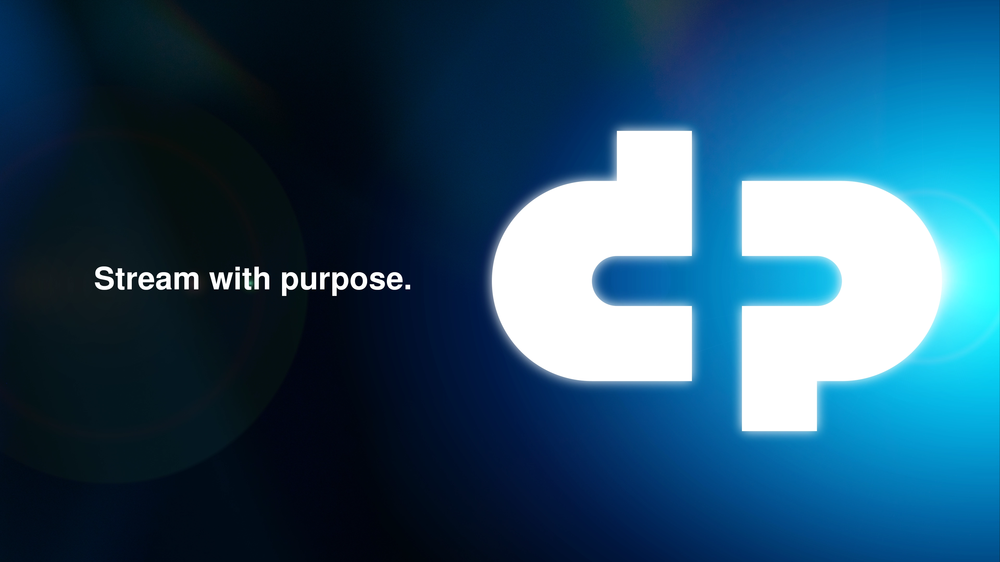

# dcpplus-brand-kit
Official brand kit and brand assets for DCP+. This repository contains essential branding elements, including logos, typography, color palettes, and usage guidelines. Designed to maintain consistency across all communications and materials.

Contents:

📌 Logos – Primary, secondary, and icon variations in multiple formats (SVG, PNG, EPS).

🎨 Color Palette – HEX, RGB, and CMYK values for brand colors.

🖋 Typography – Approved fonts and usage guidelines.

📏 Brand Guidelines – PDF and markdown documentation on proper brand representation.

🖼 Templates – Social media, presentations, and marketing collateral.

Usage:

Please follow the included brand guidelines to ensure correct application of the brand identity. For questions or special requests, contact 

—

Dear Decentralized Pictures Foundation and A3,

To ensure you retain full control over your brand assets, we kindly request that you download and relocate this repository by April 12, 2025. After this date, Co.yote will no longer maintain the repository, and responsibility for housing these files within GitHub will be transferred to Decentralized Pictures Foundation and A3.

⚠️ Action Required:
Download the repository:
Via GitHub: Click the Code button → Download ZIP

Via Git: Git clone https://github.com/parienzo/dcpplus-brand-kit.git
Relocate the files to your preferred storage solution (e.g., internal servers, cloud storage, or a new GitHub repository under your ownership).

Confirm the transfer by notifying us at pier@coyotecolectivo.com.

🔹 Backup Information:

Co.yote will retain a backup copy of the repository on our Dropbox cloud records for archival purposes. However, after the deadline, active maintenance and access through this repository will no longer be guaranteed.

For any questions or assistance in the migration, feel free to reach out to pier@coyotecolectivo.com.

Best,

Co.yote Team

