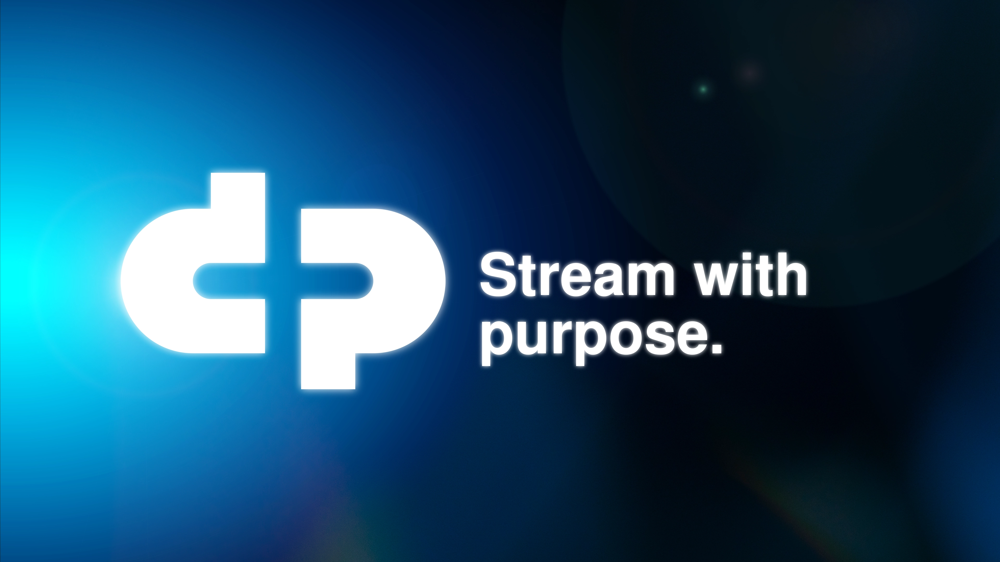

# dcpplus-brand-kit
Official brand kit and brand assets for DCP+. This repository contains essential branding elements, including logos, typography, color palettes, and usage guidelines. Designed to maintain consistency across all communications and materials.

Contents:

📏 Brand Guidelines – PDF documentation on proper brand representation.

📌 Logos – Primary, secondary, and icon variations in vector and raster formats (.svg, .png).

🎨 Color Palette – HEX, RGB, and CMYK/PANTONE values for brand colors.

🖋 Typography – Brand fonts.

🖼 Templates – Social media, corporate templates, and marketing collateral.

Please follow the included brand guidelines to ensure correct application of the brand identity. For questions or special requests, contact pier@coyotecolectivo.com

—

⚠️ Action Required:

Dear Decentralized Pictures Foundation, Inc. / A3,

To ensure you retain full control over your brand assets, we kindly request that you download and relocate this repository by April 13, 2025. After this date, active maintenance and access through this repository will no longer be guaranteed the Co.yote team, and responsibility for housing these files within GitHub will be transferred to Decentralized Pictures Foundationm Inc. and A3.

Download the repository:

Via GitHub: Click the Code button → Download ZIP

Via Git: Git clone https://github.com/parienzo/dcpplus-brand-kit.git
Relocate the files to your preferred storage solution (e.g., internal servers, cloud storage, or a new GitHub repository under your ownership).

Confirm the transfer by notifying us at pier@coyotecolectivo.com.

🔹 Backup Information:

Co.yote will retain a backup copy of the repository on our Dropbox cloud records for archival purposes. However, after the deadline, active maintenance and access through this repository will no longer be guaranteed.

For any questions or assistance in the migration, feel free to reach out to pier@coyotecolectivo.com.

Best,

Co.yote Team

